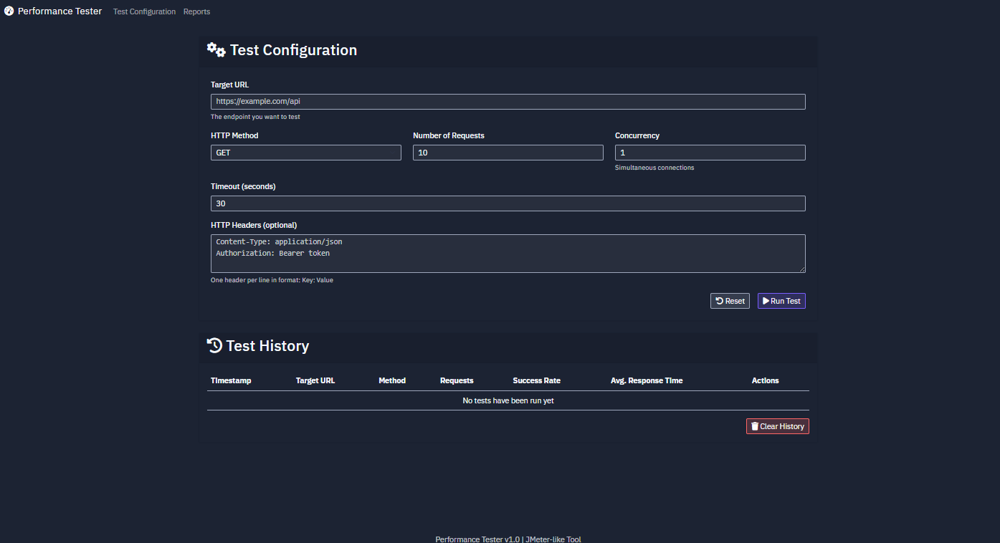

# Performance Tester

Performance Tester là một công cụ kiểm tra hiệu suất HTTP dựa trên web, tương tự như JMeter nhưng đơn giản hơn và chạy local. Công cụ cho phép bạn chạy các bài kiểm tra hiệu suất đối với các API hoặc website và tạo báo cáo chi tiết về kết quả.

## Tính năng chính

- 🚀 **Cấu hình kiểm tra dễ dàng**: Cài đặt URL, phương thức HTTP, số lượng request, và độ đồng thời
- 📊 **Báo cáo trực quan**: Xem chi tiết thời gian phản hồi, tỉ lệ thành công và phân phối mã trạng thái HTTP
- 📈 **Biểu đồ tương tác**: Gồm biểu đồ hình tròn, biểu đồ cột và biểu đồ đường cho dữ liệu kiểm tra
- 📝 **Xuất kết quả**: Xuất báo cáo dưới dạng CSV hoặc JSON để phân tích thêm
- 🕒 **Lịch sử kiểm tra**: Theo dõi các bài kiểm tra trước đó và so sánh kết quả

## Cách sử dụng

1. **Cấu hình kiểm tra**:
   - Nhập URL đích để kiểm tra
   - Chọn phương thức HTTP (GET, POST, PUT, DELETE...)
   - Cài đặt số lượng request và mức độ đồng thời
   - Thêm header HTTP và nội dung body nếu cần thiết

2. **Chạy kiểm tra**:
   - Nhấn nút "Run Test" để bắt đầu kiểm tra
   - Theo dõi tiến trình thực hiện
   - Xem báo cáo kết quả sau khi hoàn thành

3. **Phân tích kết quả**:
   - Xem các chỉ số tổng hợp (thời gian phản hồi trung bình, thông lượng, tỉ lệ thành công...)
   - Khám phá biểu đồ phân phối thời gian phản hồi
   - Kiểm tra phân phối mã trạng thái HTTP
   - Xem dữ liệu chi tiết cho từng request

4. **Xuất và chia sẻ kết quả**:
   - Xuất báo cáo dưới dạng CSV hoặc JSON
   - Lưu lịch sử kiểm tra để tham khảo sau này

## Thông số đánh giá

Công cụ thu thập và hiển thị các thông số sau:

- **Thời gian phản hồi**: Trung bình, min, max, trung vị, phân vị thứ 90, 95, 99
- **Thông lượng**: Số request mỗi giây
- **Tỉ lệ thành công**: Phần trăm request thành công
- **Phân phối mã trạng thái**: Số lượng từng mã trạng thái HTTP
- **Kích thước phản hồi**: Tổng kích thước dữ liệu nhận được
- **Lỗi**: Chi tiết về bất kỳ lỗi nào xảy ra trong quá trình kiểm tra

## Yêu cầu kỹ thuật

- Python 3.11+
- Flask
- Requests
- pandas
- Chart.js (được tải qua CDN)
- Bootstrap (được tải qua CDN)

## Cài đặt và chạy

1. Clone repository này
2. Cài đặt các thư viện cần thiết: `pip install -r requirements.txt`
3. Chạy ứng dụng: `python main.py`
4. Mở trình duyệt web và truy cập: `http://localhost:5000`

## Use Cases

- Kiểm tra hiệu suất API trong quá trình phát triển
- So sánh hiệu suất trước và sau khi tối ưu hóa mã
- Xác định vấn đề về khả năng mở rộng với các API hoặc dịch vụ web
- Đặt mốc hiệu suất cho các ứng dụng web mới
- Mô phỏng tải cao để kiểm tra khả năng chịu tải của dịch vụ

## Cải tiến trong tương lai

- [ ] Hỗ trợ chứng thực OAuth
- [ ] Tạo báo cáo PDF
- [ ] Thêm các mẫu test từ trước
- [ ] So sánh kết quả giữa nhiều bài kiểm tra
- [ ] Kiểm tra dựa trên kịch bản (tuần tự các request)
